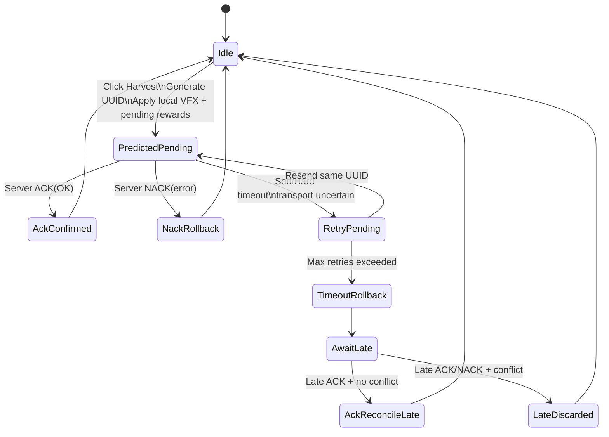
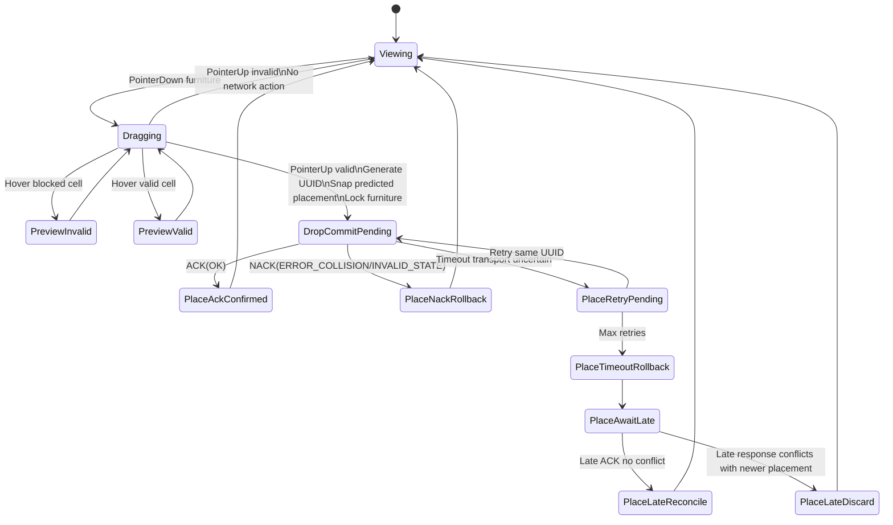

# Optimistic Action Lifecycle for Harvest / Purchase / Place

This document defines a deterministic optimistic action protocol for client/server interactions that affect economy and world state.

## Goals
- Keep interactions instant for players (local prediction).
- Maintain server authority for anti-cheat and consistency.
- Make rollback/reconciliation deterministic and debuggable in production.

---

## 1) Client Action Envelope, UUIDs, and Pending Queue

Every mutable user action is wrapped in a standard envelope before being sent.

```ts
interface ActionEnvelope<TPayload> {
  actionUuid: string;          // UUID v7 (sortable) generated client-side
  clientSeq: number;           // Monotonic per-session sequence
  actionType: 'HARVEST' | 'PURCHASE' | 'PLACE_START' | 'PLACE_COMMIT' | 'PLACE_CANCEL';
  playerId: string;
  roomId: string;
  idempotencyKey: string;      // actionUuid (or actionUuid + actionType)
  payload: TPayload;
  sentAtMs: number;            // client monotonic time
  schemaVersion: number;
}
```

### UUID generation
- Use UUID v7 to preserve temporal ordering for logs.
- Generate exactly once per intent (click/tap/drop), never per retry.
- Reuse the same `actionUuid` on retries so server-side idempotency can collapse duplicates.

### Pending-action queue
Client keeps `pendingActions: Map<actionUuid, PendingAction>` where each entry stores:
- `baseSnapshot`: minimal pre-action state required for exact rollback.
- `predictedPatch`: optimistic diff currently applied to local state.
- `retryCount`, `firstSentAtMs`, `lastSentAtMs`, `deadlineMs`.
- `status`: `pending | acked | nacked | timed_out | reconciled`.

Queue invariants:
- At most one pending action per exclusive entity (e.g., same tileId or same furnitureId) unless action type explicitly supports pipelining.
- New action touching a locked entity is blocked in UI with “syncing…” indicator.

---

## 2) Local Predicted Effects (Apply Immediately)

### Harvest prediction
Immediately on click:
- Play harvest VFX/SFX.
- Hide crop / mark tile as “collecting”.
- Increment temporary wallet delta (coins/items) in HUD as **pending**.

### Purchase prediction
Immediately on buy:
- Decrement displayed coins/gems as pending.
- Add purchased item to inventory as pending.
- Disable repeated buy button for same SKU while pending.

### Placement (drag/drop) prediction
During drag:
- Move ghost object locally with collision tint (valid/invalid).

On drop (commit intent):
- Snap furniture to target grid cell in local world.
- Mark item with pending style (outline/spinner).
- Lock furniture interaction until ack/nack or timeout terminal state.

Prediction rules:
- Predicted patch must be reversible without recomputing from current state.
- UI must distinguish pending values from confirmed values.

---

## 3) Server ACK/NACK Semantics and Rollback/Reconciliation

Server is authoritative. It must respond with the same `actionUuid` and `resultCode`.

```ts
interface ActionResult {
  actionUuid: string;
  resultCode:
    | 'OK'
    | 'ERROR_NOT_READY'
    | 'ERROR_INSUFFICIENT_FUNDS'
    | 'ERROR_COLLISION'
    | 'ERROR_INVALID_STATE'
    | 'ERROR_DUPLICATE'
    | 'ERROR_TIMEOUT_WINDOW_EXCEEDED';
  authoritativeStatePatch?: unknown; // canonical patch after validation
  serverTsMs: number;
}
```

### ACK (`resultCode = OK`)
1. Find pending entry by `actionUuid`.
2. Remove pending markers.
3. Apply `authoritativeStatePatch`.
4. If authoritative patch differs from predicted patch, reconcile with canonical data and emit mismatch telemetry.

### NACK (`resultCode != OK`)
1. Find pending entry by `actionUuid`.
2. Roll back exactly using `baseSnapshot` (not inverse heuristics).
3. Optionally apply server patch if included (e.g., wallet corrected).
4. Surface user-facing reason (not ready, insufficient funds, blocked tile, etc).

### Exact rollback policy
- Rollback is functional: `state = apply(baseSnapshot)` then optional canonical patch.
- Do not “undo from current” because concurrent non-related state may have changed.

### Reconciliation policy
Use reconciliation instead of plain rollback when:
- Action succeeded but computed rewards differ (loot modifiers, server-side bonuses).
- Placement accepted but snapped differently due to canonical collision map.

---

## 4) Timeout, Retry, Duplicate Prevention, and Late Responses

### Timeout policy
- `softTimeoutMs` (e.g., 1200 ms): show syncing spinner/escalated latency UI.
- `hardTimeoutMs` (e.g., 5000 ms): action enters terminal timeout handling.

### Retry vs fail
- Retry automatically for transport-level uncertainty (socket reconnect, no response).
- Do **not** retry on explicit NACK business errors.
- Max retries: `2` with exponential backoff + jitter (e.g., 250ms, 700ms).

### Duplicate submission prevention
Client side:
- Disable/lock duplicate UI intents on same logical target while pending.
- Reuse same `actionUuid` for retry, never create a fresh intent for same click.

Server side:
- Keep short-lived idempotency cache keyed by `(playerId, actionUuid)`.
- If duplicate arrives after processed success/failure, return prior `ActionResult` with `ERROR_DUPLICATE` or prior canonical result (preferred).

### Late response handling
If ack/nack arrives after client marked action `timed_out`:
- If entity/version unchanged since timeout rollback, accept late result and reconcile.
- If conflicting newer local actions already committed, ignore patch for state mutation and only log telemetry with `late_response_discarded=true`.
- Always clear pending entry by `actionUuid` if still present.

---

## 5) State Diagram: Economic Action (Harvest)



---

## 6) State Diagram: Placement Action (Furniture Drag/Drop)



---

## 7) Telemetry for Production Mismatch Debugging

Emit one structured event per lifecycle phase (`sent`, `retry`, `ack`, `nack`, `timeout`, `late_response`).

Minimum fields:
- `action_uuid` (string)
- `action_type` (enum)
- `player_id`, `room_id`
- `client_seq`
- `target_entity_id` (tileId/furnitureId/sku)
- `result_code` (OK / specific error)
- `latency_ms` (`receiveTs - sentTs`)
- `retry_count`
- `timed_out` (bool)
- `late_response` (bool)
- `late_response_discarded` (bool)
- `predicted_hash` (hash of predicted patch)
- `authoritative_hash` (hash of server patch)
- `reconciled` (bool)
- `rollback_applied` (bool)
- `client_version`, `schema_version`
- `network_state` (rtt bucket / reconnecting / online)

Recommended derived dashboards:
- ACK rate and NACK rate by `action_type` + `result_code`.
- P95/P99 `latency_ms` by region/room size.
- Reconciliation rate (`predicted_hash != authoritative_hash`).
- Late-response discard rate (indicates client ordering/version conflicts).

---

## 8) Action-Specific Notes

### Harvest
- Lock tile while pending to prevent multi-harvest spam.
- If server says `ERROR_NOT_READY`, rollback crop visibility and pending rewards immediately.

### Purchase
- Keep pending debit visually separate from confirmed wallet until ACK.
- On NACK insufficient funds, revert wallet and inventory atomically.

### Place
- Use server-side collision and ownership as final authority.
- On ACK with adjusted position, animate furniture to canonical cell (short tween) to hide snap correction.
